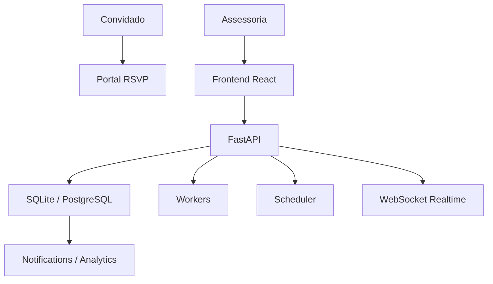
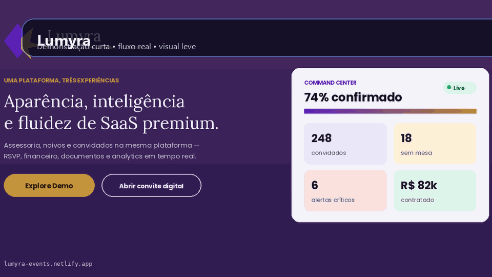
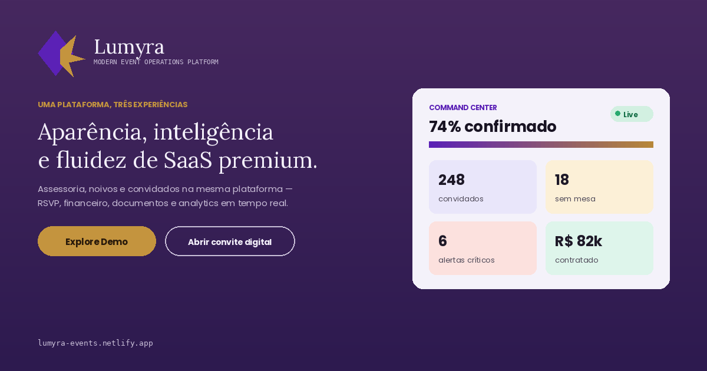

# Lumyra


## Visao geral

Modern Event Operations Platform. Lumyra e uma plataforma SaaS para operacao de eventos sociais e corporativos, conectando assessorias, clientes e convidados em uma experiencia com RSVP, WhatsApp, formularios dinamicos, mapa de mesas, financeiro, documentos, analytics, workflows e realtime.

## Problema

- Operacao fragmentada entre planilhas, mensagens e ferramentas isoladas.
- Falta de rastreabilidade em RSVP, mesas e comunicacao.
- Dificuldade de manter experiencia premium para convidados.

## Solucao

O projeto foi desenhado como um produto premium para operacao de eventos. A proposta e unir experiencia do convidado, controle operacional e comunicacao em tempo real.

[Live demo](https://lumyra-events.netlify.app)

## Arquitetura



## Tecnologias

Python, FastAPI, React, TypeScript, Tailwind CSS, WebSocket, SQLite, Docker, Netlify.

## Funcionalidades

- Landing page SaaS.
- Login e demo mode.
- Area da assessoria/admin.
- Area dos noivos/clientes.
- Portal do convidado mobile-first.
- Notification center.
- Realtime indicator e WebSocket.
- Demo integrada entre personas.

## Demonstração

- Demo publica: [lumyra-events.netlify.app](https://lumyra-events.netlify.app)
- Convite de demonstração: link publico do portal do convidado

## GIF



## Screenshots



## Como executar

### Frontend

```bash
cd frontend_web
npm ci
npm run dev
```

### Backend

```bash
python -m venv .venv
pip install -r requirements.txt
uvicorn backend.main:app --reload
```

### Docker

```bash
cp .env.example .env
docker compose up --build
```

## Estrutura do projeto

```text
frontend_web/   frontend principal
backend/        API
services/       negocio
workers/        jobs
db/             banco e models
migrations/     migrations
docs/           doc tecnica
storage/        armazenamento local
tests/          testes
assets/demo/    screenshots e GIFs
```

## Roadmap

- Adicionar galerias reais de telas no README.
- Continuar a consolidacao da migracao para PostgreSQL.
- Evoluir RBAC e observabilidade.

## Principais aprendizados

- Arquitetura em camadas
- APIs REST
- Docker
- PostgreSQL
- Machine Learning
- FastAPI
- React
- Clean Architecture
- Design Patterns
- Automacoes
- Engenharia de Dados

## Licenca

TODO.
