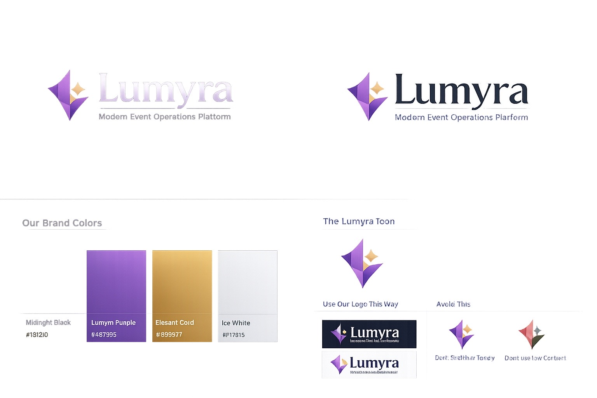

# Lumyra

Modern Event Operations Platform.

Lumyra e uma plataforma SaaS para operacao de eventos sociais e corporativos, conectando assessorias, clientes e convidados em uma experiencia com RSVP, WhatsApp, formularios dinamicos, mapa de mesas, financeiro, documentos, analytics, workflows e realtime.

[Live demo](https://lumyra-events.netlify.app)

## Visao geral

O projeto foi desenhado como um produto premium para operacao de eventos. A proposta e unir experiencia do convidado, controle operacional e comunicacao em tempo real.

## Problema que resolve

- Operacao fragmentada entre planilhas, mensagens e ferramentas isoladas.
- Falta de rastreabilidade em RSVP, mesas e comunicacao.
- Dificuldade de manter experiencia premium para convidados.

## Arquitetura

```text
frontend_web/   React, Vite, TypeScript e Tailwind
backend/        FastAPI, rotas, schemas e JWT
services/       regras de negocio
workers/        jobs e tarefas em background
db/             SQLAlchemy e models
migrations/     Alembic
docs/           documentacao tecnica
```

## Screenshots




## Funcionalidades

- Landing page SaaS.
- Login e demo mode.
- Area da assessoria/admin.
- Area dos noivos/clientes.
- Portal do convidado mobile-first.
- Notification center.
- Realtime indicator e WebSocket.
- Demo integrada entre personas.

## Tecnologias

Python, FastAPI, React, TypeScript, Tailwind CSS, WebSocket, SQLite, Docker, Netlify.

## Como executar

### Frontend

```bash
cd frontend_web
npm ci
npm run dev
```

### Backend

```bash
python -m venv .venv
pip install -r requirements.txt
uvicorn backend.main:app --reload
```

### Docker

```bash
cp .env.example .env
docker compose up --build
```

## Estrutura do projeto

```text
frontend_web/   frontend principal
backend/        API
services/       negocio
workers/        jobs
db/             banco e models
migrations/     migrations
docs/           doc tecnica
storage/        armazenamento local
tests/          testes
```

## Roadmap

- Adicionar galerias reais de telas no README.
- Continuar a consolidacao da migracao para PostgreSQL.
- Evoluir RBAC e observabilidade.

## Licenca

TODO.
